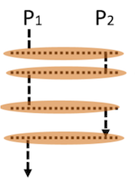


这是我总结的操作系统的考点，但内容并不完善，可以参考[这篇笔记](https://jjlde7r0bk.feishu.cn/wiki/wikcnjqZ54DulF74jkJayfSN48d)，里面有更详细的我关于知识点的记录


## Chapter 1
> updated in 2023.1.13

**1. Monolithic OS（单一型）的优缺点？（单一型是os类型之一，用户和系统放在一起）**
- 优：(1) efficient; (2) better performance
- 缺：(1) Difficult to impose security; (2) difficult to maintain
  
**2. Layered OS：**
- 优：security
- 缺：hard to manage; weak performance
  
**3. Micro-Kernel OS (微内核os)：**
- 优：security；extensible
- 缺：inefficient
  
**4. Library OS (库操作系统)：**
- 优：libraries provide additional security and personality
- 缺：less consistency(缺乏稳定性)

---

## Chapter 2
> updated in 2023.1.13

**1. One or more threads in a single process**
- Thread: smallest sequence of instructions managed independently by scheduler. 
- Scheduler: method for how work is assigned to resources to complete work

**2. Concurrency & parallelism (并发和并行)的区别？**
- Concurrency: processes are underway simultaneously, different processes execute one by one.

<!--  -->

- Parallelism: Multiple (n \> 1) processes executing simultaneously. 

<!--  -->

<!--  	 -->
- 对于并发，在同一时间点任务不同时execute；对于并行，在同一时间点任务一定同时execute，并发和并行都是针对process而言的
- Processes are always concurrent, but not always parallel


**3. 怎样创建一个线程：通过implement Runnable 类，里面有一个public void run( ) 方法**
- Define class R which implements Runnable
- Create your objects
	- Make an instance of class R 
	- Make a thread instance by passing instance of   class R to the constructor of class Thread
- Class start() method of the thread instance
	- This causes java to immediately execute R.run() as a new thread
- 替代方法还可以创建一个类继承Thread类，理论上和实现Runnable是一样的
	```java
	public class MessagePrinter extends Thread
	  { 
	     String message; 
	     public MessagePrinter(String m) 
	        { 
	           message = m; } 
	     public void run() 
	         { for(int i = 0; i < 1000; i++)    
	     System.out.println(message); 
	         }
	 }

	```

**4.  Processor（处理器）, program（程序）, process（进程） 三者区别？**
- Processor: _Hardware device_ that executes machine instructions
- Program: _Instruction sequence_; Stored on disk 指令集；存储在硬盘上
- Process：_Program in execution_ on a processor; store in primary memory
- Program may be executed by multiple processes at the same time

<!--  -->
- Process can run multiple programs. (多个thread)

<!--  -->


**5. When do we not have to worry about concurrency?**
- no shared data or communication
- read only data


**6. When should we worry about concurrency? （并发带来坏的影响）**
- Threads access a shared resource without synchronization
- One or more threads modify the shared resource

---

## Chapter 3

> updated in 2023.1.13


**1. Moore’s Law: Number of transistors in dense(密集) integrated circuits doubles every 2 years.**

**2. 为什么要用并行？（两个原因）**
  - Moore’s Law(硬件): Number of transistors in dense(密集) integrated circuits doubles every 2 years.
  - Amdahl’s Law(软件)：Speed up is limited by the serial（程序串行） part of the program


**3. Definition of race condition**
- An error (e.g. a lost update) that occurs due to multiple processes ‘racing’ in an uncontrolled manner through a section of non-atomic code


**4. 什么是临界区（critical section）?**
  - Code section that accesses a shared resource.


**5. What is Mutual exclusion?**
- Only one thread can run within the critical section at any given time


**6. 建立临界区的4种方法？**
  - Lock: 
	- 设置两个状态held/not held，held表示有线程在critical section
	- acquire代表需要lock，release代表不需要lock
	 and release( )")
	- lock在java中通过synchronized语句实现，synchronized可以应用于任何的代码块
		```java
		public void synchronized update (int a) 
		{
		     balance=balance+a;
		 }

		```
- Monitors
  - Semaphores
  - Message


**7. Atomic**
- A property of a sequentially-executed section of code
- A context switch can’t happen (by definition) while an atomic section of code is being executed


**8. Lock acquire( ) only blocks threads attempting to acquire the same lock. Must use same lock for all critical sections accessing the same data.**

**9. Three steps of context-switching sequence**
- De-schedule currently-running thread
- Scheduler selects ‘best’ ready thread to run next 
- Resume newly-selected thread 

---

## Chapter 4

> updated in 2023.1.16


**1. 信号量（改错）：**
```c
typedef struct _sem { 
    int val; /* semaphore  value*/ 
    Queue queue; / oper: put, get*/ 
} Sem
void P(Sem s) { /* wait() procedure */ 
      s->val = s->val - 1; 
      if (s->val < 0) { 
           put(s->queue, getpid()); /* queue of PIDs */ 
            sleep(getpid()); } } 
void V(Sem s) { /* signal() procedure */ 
        s->val = s->val + 1; 
         if (s->val >= 0){ 
           wakeup(get(s->queue));} }
```
- P等同于wait，V等同于signal
- `sleep`是通过把这个线程放到waiting queue中来block这个线程
- `wakeup`是唤醒waiting queue中的线程，并放到running queue中

**2. P，V操作如何在java和C下实现的？**
  - Java: wait() & notify()
  - C: acquire() & release()
  - Unix: sleep() & wakeup()
  - Distributed system分布式系统（Message Passing）: send() & receive()

**3. 虚假唤醒（Spurious wakeup）是考试中一道大题**
```java
public class Semaphore { 
    private int count = 0;   
    public Semaphore(int init_val){ 
         count = init_val; 
    } 
    public synchronized void P() { 
        count = count - 1; 
        if (count < 0) wait(); 
    } 
    public synchronized void V() { 
        count = count + 1;
        notifyAll(); 
    }
}
```
- 什么时候会引起虚假唤醒？
- Answer: Does not recheck the condition，把P中的`if`改为`while`

**4. 编程题： put() get()操作**
```java
public class BoxDimension{
   private int dim = 0;
   private Semaphore sem = 1;
   public void put(int d) {
       dim = d; 
       sem.signal();
   } 
   public int get() {  
       sem.wait();
       return dim; 
    }
} 
BoxDimension d = new BoxDimension();
```
  
**5. Java中的semaphore**
```java
public class Semaphore { 
    private int count = 0; 
    public Semaphore(int init_val) { 
           count = init_val; // Should check it’s >= 0 
    } 
    public synchronized void P() { 
           count = count - 1; 
           while (count < 0) wait(); // why not ‘if’? 
       } 
    public synchronized void V() { 
            count = count + 1; /* if there is one, wake a waiter; */
            notifyAll(); /* why not use ‘notify()’? */ 
    } 
}
```
- P中要使用`while`来判断是否要wait，因为如果条件满足要一直wait
- V中要使用`notifyAll()`，而不是`notify()`，因为`notify()`会导致deadlock

---

## Chapter 5
