## 公式推导
用有符号距离函数表示空间点p到物体表面的距离，sdf(p)等于0
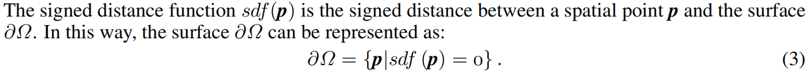

使用两个神经网络估计SDF和颜色场
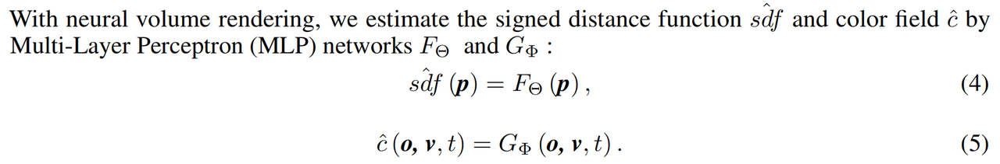

表示颜色场：
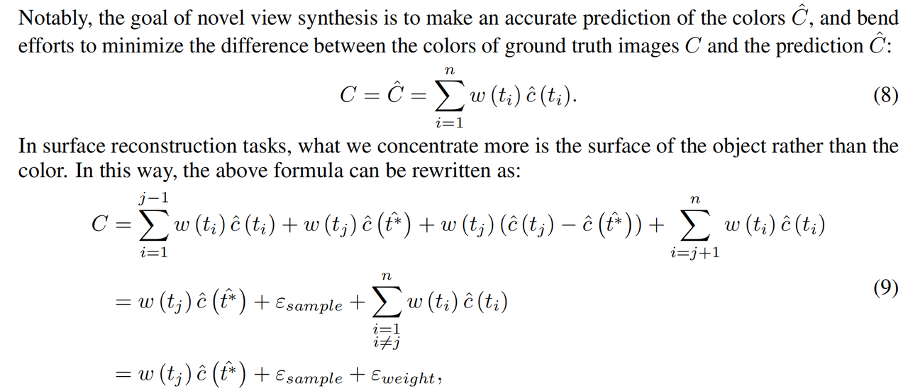

由于需要专注于表面的重建，所以将公式改写为
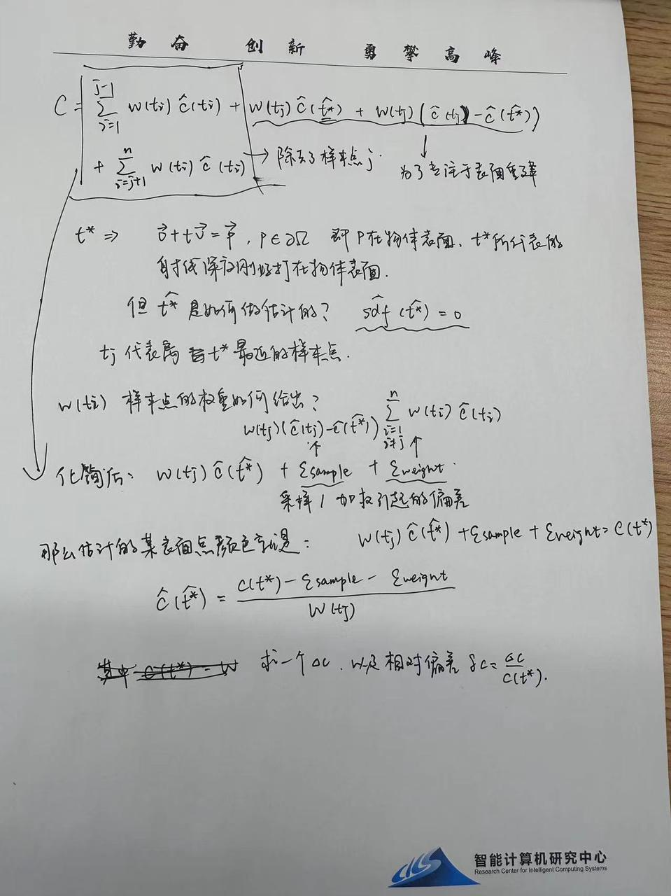

最后得到偏差的表达式：
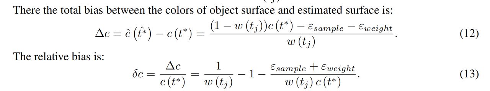

网络的架构图，结合了三种loss，五个通道
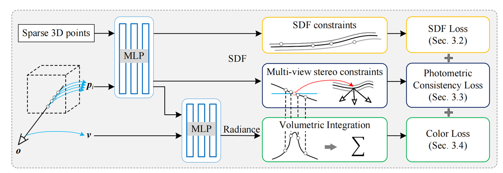

闭塞处理，这里没有看懂在干什么
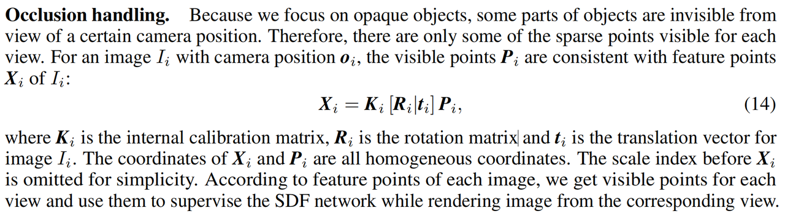

SDF loss
View-aware SDF loss. While rendering image $I_i$ from view $V_i$, we use the SDF network to estimate SDF values for the visible points $\boldsymbol{P}_i$ of $V_i$. Based on the approximation that the SDF values of sparse points are zeroes, we propose the view-aware SDF loss:
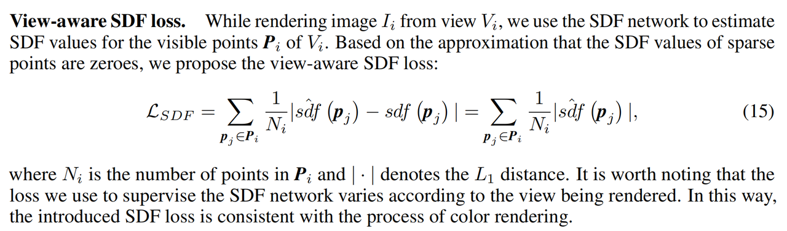
值得注意的是，我们用来监督SDF网络的损失根据所呈现的视图而有所不同。这样，引入的SDF损失与显色渲染的过程是一致的。
这个loss应该向0收敛吗？是的
这里提到了他的模型使用了几何先验，是使用了什么作为先验？

表达隐式平面，通过正负距离确定表面点。使用线性插值的方法求交点集。
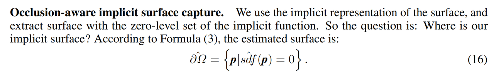
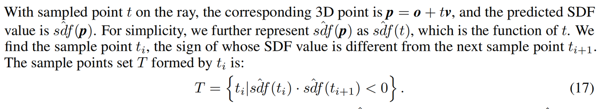
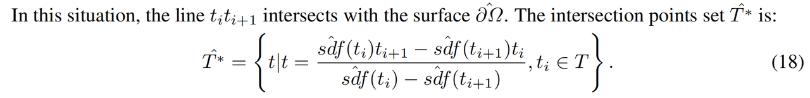
多视角的几何约束：

使用MVS中的光学一致性来监督隐式表面的生成
MVS：MVS（Multi-View Stereo）的目的是在已知相机位姿的前提下估计稠密的三维结构，如果相机位姿未知则会先使用SfM得到相机的位姿。评估的稠密结构真值一般是基于Lidar（ETH3D[4]、Tanks and Temples[5]）或者深度相机（DTU[6]）获得整个场景的点云，而对应的相机位姿有的在采集的时候就通过机械臂直接获取[6]，有的则基于采集的深度进行估计[4][5]。
有了场景点云之后，一般评估指标为精度和完整度，同时还有二者的平衡指标F1分数。
1) 精度（Accuracy）：对于每个估计出来的3D点寻找在一定阈值内的真值3D点，最终可以匹配上的比例即为精度。需要注意的是，由于点云真值本身不完整，需要先估计出真值空间中不可观测的部分，估计精度时忽略掉。
2) 完整度（Completeness）：将每个真值的3D点寻找在一定阈值内最近的估计出来的3D点，最终可以匹配上的比例即为完整度。
3) F1分数（F1 Score）：精度和完整度是一对trade-off的指标，因为可以让点布满整个空间来让完整度达到100%，也可以只保留非常少的绝对精确的点来得到很高的精度指标。因此最终评估的指标需要对二者进行融合。假设精度为p，完整度为r，则F1分数为它们的调和平均数，即2pr / (p + r)。

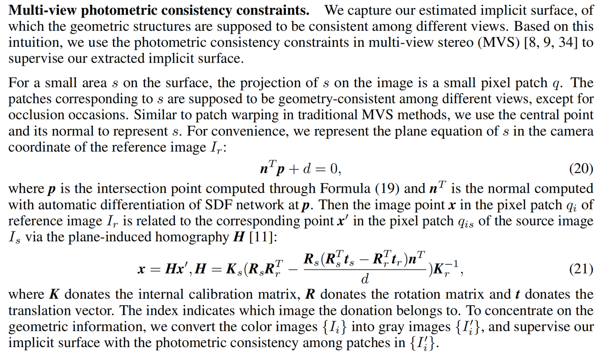
然后得出几何一致损失

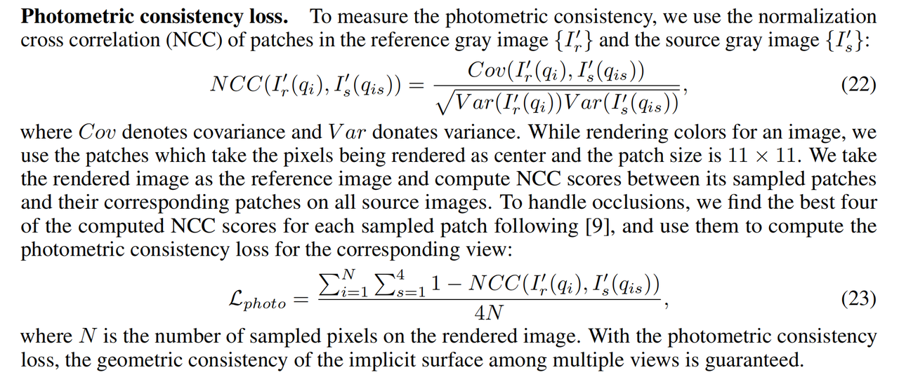

总体的损失函数：
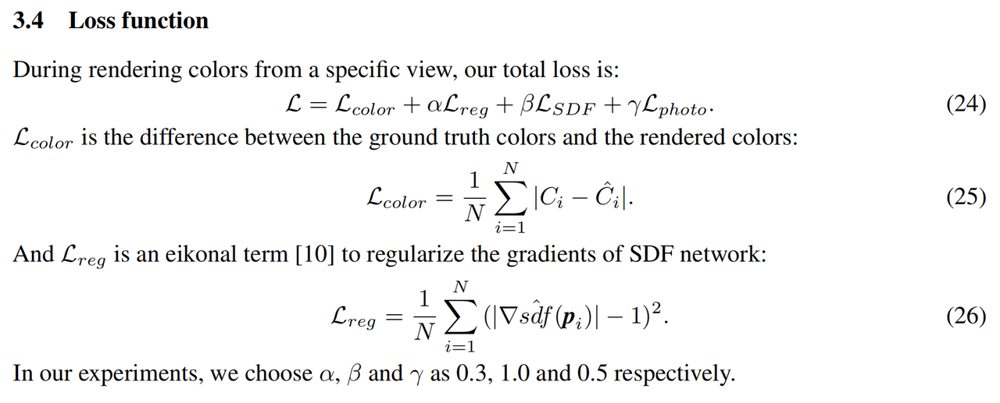

## 代码复现
>GitHub网址：[点击跳转](https://github.com/GhiXu/Geo-Neus)
1. conda activate报错

    ```shell
    CommandNotFoundError: Your shell has not been properly configured to use 'conda activate'.
    ```
    解决方案：

    ```shell
    source activate # 执行后命令行出现base标识
    conda activate ...
    ```

2. conda activate pytorch 报错
    ```shell
    Could not find conda environment: pytorch
    You can list all discoverable environments with `conda info --envs`.
    ```
    
    ```shell
    conda install pytorch
    ```
    
    ```shell
    Executing transaction: failed
    ERROR conda.core.link:_execute(502): An error occurred while installing package 'conda-forge::certifi-2022.9.24-pyhd8ed1ab_0'.
    FileNotFoundError(2, "No such file or directory: '/home/hanqi/.conda/envs/geoneus/bin/python3.7'")
    
    Attempting to roll back.

    Rolling back transaction: done

    FileNotFoundError(2, "No such file or directory: '/home/hanqi/.conda/envs/geoneus/bin/python3.7'")
    ```
    默认的安装路径是错的，我把forge卸载了，之后可以正常安装
    ```shell
    anaconda search -t conda fvcore
    anaconda show ...
    ```

    不知道为什么，anaconda3文件夹设置的是read only，如果要进行更新操作必须切换root用户
    ```shell
    sudo s # 切换root用户
    exit # 退出回到原来的用户
    ```

3. 程序运行一段时间被kill了，定位发现是在这句话的时候
    ```python
    self.images_gray = torch.from_numpy(self.images_gray_np.astype(np.float32)).cuda()
    ```
    .cuda()是把数据储存到显卡里，可能是数据量太大了，我删除了一些照片，还剩十几张

4. 训练过程中报错缺失npy文件
    ```shell
    FileNotFoundError: [Errno 2] No such file or directory: 'pikachu_aruco/sfm_pts/points.npy'
    ```
    查找后发现是作者没有给出这个文件的计算方法，只是说要modify [这个文件](https://github.com/GhiXu/ACMP/blob/master/colmap2mvsnet_acm.py)
    运行指令需要两个，一个是数据文件夹，一个是保存的路径，直接运行报下面的错误
    ```shell
    FileNotFoundError: [Errno 2] No such file or directory: 'pikachu_aruco/sparse/cameras.txt'
    ```
    这个文件作者没有提供，也没有解释文件的内容是什么

5. 对loss function具体内容的再阐述  
   整个网络的输入是稀疏点和多视角照片（可以参考网络架构图）  
   ```python
   def forward(self, inputs):
        """
        :type input_rgb: object
        """
        inputs = inputs * self.scale

        if self.embed_fn_fine is not None:
            inputs = self.embed_fn_fine(inputs)

        x = inputs

        for l in range(0, self.num_layers - 1):
            lin = getattr(self, "lin" + str(l))

            if l in self.skip_in:
                x = torch.cat([x, inputs], 1) / np.sqrt(2)

            x = lin(x)

            if l < self.num_layers - 2:
                x = self.activation(x)
   ```
  * sdf网络中的forward函数其实返回的就是点的sdf值，对应文章中所说的MLP
  * 监督过程发生在渲染的同时，渲染的同时我们会返回一个点的sdf值，那么我们已有的三维稀疏点也可以进行渲染，利用sdf网络来返回sdf值，因为我们假设三维稀疏点在表面，因此我们试着用网络来返回，如果网络准确，它应该返回一个接近于0的值，同时为了弥补三维稀疏点的缺陷，也进行一个视角射线的抽样，利用多视角的照片，进行操作抽取点，这些是中间的过程，就是所谓的隐式曲面的抽取。同样为了监督隐式曲面的抽取，光度一致性损失被提出，这些都是中途的过程。综合来说，输入只有三位稀疏点和各个角度的照片。
   ```python
      # Loss
      color_error = (color_fine - true_rgb) * mask
      color_fine_loss = F.l1_loss(color_error, torch.zeros_like(color_error), reduction='sum') / mask_sum
      psnr = 20.0 * torch.log10(1.0 / (((color_fine - true_rgb)**2 * mask).sum() / (mask_sum * 3.0)).sqrt())
      
      eikonal_loss = gradient_error
      
      mask_loss = F.binary_cross_entropy(weight_sum.clip(1e-3, 1.0 - 1e-3), mask)
      
      sdf_loss = F.l1_loss(pts2sdf, torch.zeros_like(pts2sdf), reduction='sum') / pts2sdf.shape[0]
      
      ncc_loss = 0.5 * (ncc_cost.sum(dim=0) / (inside_sphere.sum(dim=0) + 1e-8)).squeeze(-1)
      
      loss = color_fine_loss + eikonal_loss * self.igr_weight + mask_loss * self.mask_weight + sdf_loss + ncc_loss
   ```
* 以上是loss的具体计算过程