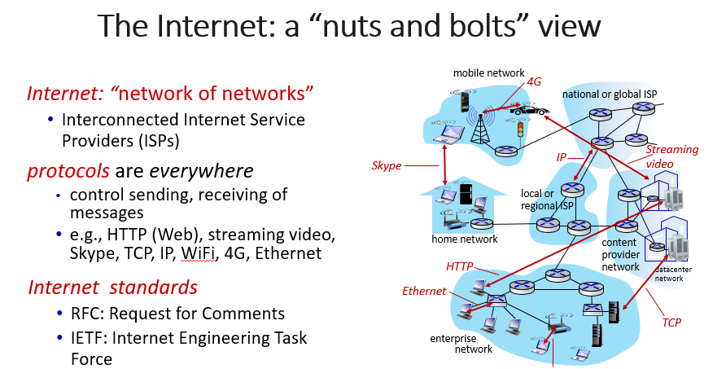

# 计网复习

## Week 1
> updated in 2023/1/27

### 1. What is a network
  - Any set of interconnected nodes through horizontal and or vertical lines.
  - 通过平行或者垂直的线，连接起来的节点的集合
  - 有什么样的网络，（除了计网之外的例子）: Telephone network carrying voice traffic, Cable network to disseminate video signals

### 2. 什么是计算机网络？computer network
  - A computer network is a group of computers that use a set of common communication protocols over digital interconnections for the purpose of sharing resources.  
  - 计算机网络是一组计算机，它们通过数字互连使用一套共同的通信协议，以达到共享资源的目的。
  - Set of connected autonomous computers (having programmable hardware) 是一系列自治的，互联的，有可编程硬件的计算机的集合

#### 2.1 计网的功能，为什么需要计网
Resource Sharing, Information Sharing, Ease in Communication 资源共享，信息共享，方便沟通

#### 2.2 计网的类型
##### 2.2.1 直接连接
- 点对点point to point 就是两台计算机一条线连起来，常用于远程的广域网链接
- 多重连接multiple access 就是多台计算机连接一条总线,通常用于局域网链接

##### 2.2.2 非直接连接
- （用交换机）电路交换，包交换

### 3. 什么是互联网？internet
- The internet is a computer network that interconnects billions of computing devices using communication links and packet switches.
  - 互联网是一个计算机网络，利用通信链路和分组交换机将数十亿的计算设备（称为主机或终端系统）互联起来。
  - 互联网是最为熟知的计算机网络。
  - 有两种不同的描述internet的方法，一种是由组成部件去描述internet，另一种是从提供服务的角度描述internet

#### 3.1 a “nuts and bolts” view，具体来看什么是internet
- The basic hardware and software components that make up the Internet.

##### 3.1.1 Devices 
- 主机（hosts） = 终端（end systems）
- running network apps at internet's eges

##### 3.1.2 Packet switches
- 路由器（routers）
- 交换机（switches）

##### 3.1.3 Communication links
- 光纤、铜线、无线电、卫星fiber copper radio satellite 
- 传输速率：带宽

##### 3.1.4 Networks 
    1. 设备、路由器、链接的集合：由一个组织管理collection of devices, routers, links: managed by an organization
