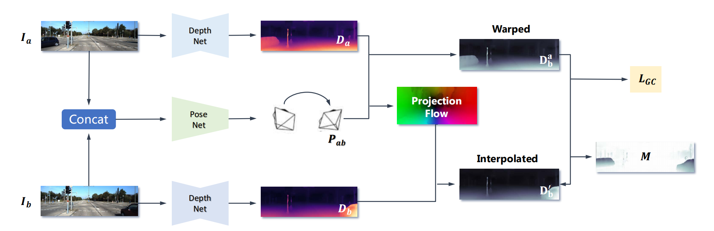
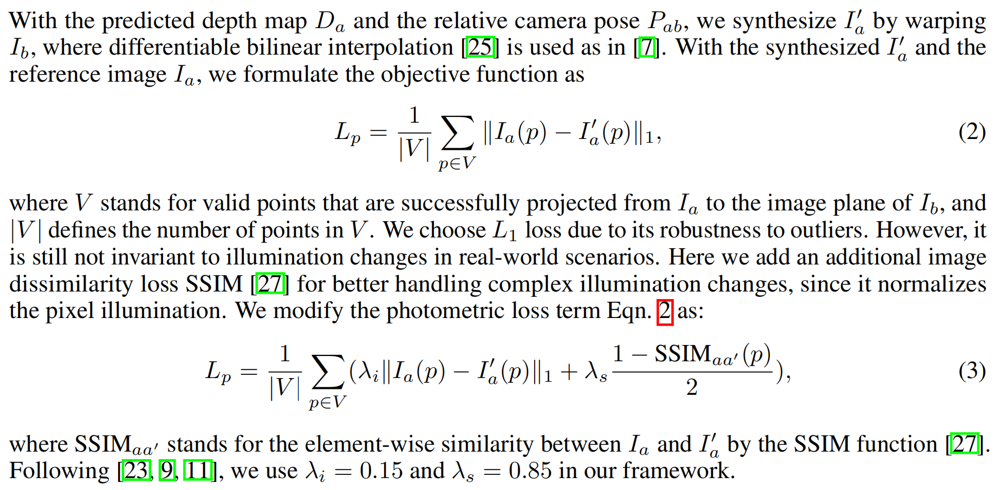
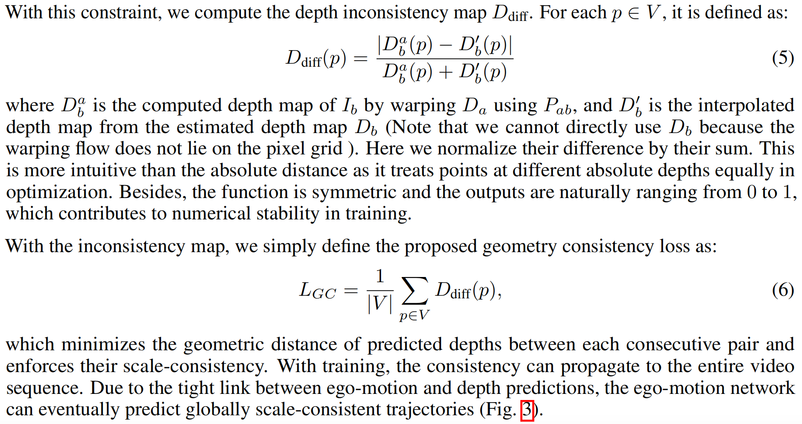
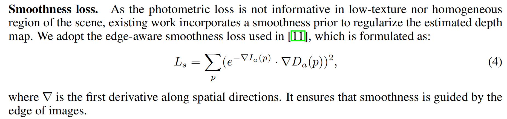

# Unsupervised Scale-consistent Depth and Ego-motion Learning from Monocular Video

# Unsupervised Scale-consistent Depth and Ego-motion Learning from Monocular Video

> 根据摘要来看，文章主要提出了一种深度网络能够得出深度图
>  所以文章中的loss很有可能是主要对深度网络的表现做优化  
> 
>  code：[点击跳转](https://github.com/JiawangBian/SC-SfMLearner-Release)

## 论文笔记
取连续两帧，通过深度网络转换成深度图，通过pose net得到相机位姿，将二者输入损失函数中

* 这里需要看一下这个连续帧我们可不可以换成两个视角的照片
### photometric loss and geometry loss

* 光度一致性损失，这里没有看明白是如何把Ia投影到Ib，到底是否用到深度信息了，后面在代码部分探讨。

* 深度一致性损失比较好理解，就是直接通过深度图计算深度difference，作为深度一致性损失。
#### 结合代码
根据上面的损失函数描述，定位到文件`loss_functions.py`
```python
class SSIM(nn.Module):
    """Layer to compute the SSIM loss between a pair of images
    """

    def __init__(self):
        super(SSIM, self).__init__()
        self.mu_x_pool = nn.AvgPool2d(3, 1)
        self.mu_y_pool = nn.AvgPool2d(3, 1)
        self.sig_x_pool = nn.AvgPool2d(3, 1)
        self.sig_y_pool = nn.AvgPool2d(3, 1)
        self.sig_xy_pool = nn.AvgPool2d(3, 1)

        self.refl = nn.ReflectionPad2d(1)

        self.C1 = 0.01 ** 2
        self.C2 = 0.03 ** 2

    def forward(self, x, y):
        x = self.refl(x)
        y = self.refl(y)

        mu_x = self.mu_x_pool(x)
        mu_y = self.mu_y_pool(y)

        sigma_x = self.sig_x_pool(x ** 2) - mu_x ** 2
        sigma_y = self.sig_y_pool(y ** 2) - mu_y ** 2
        sigma_xy = self.sig_xy_pool(x * y) - mu_x * mu_y

        SSIM_n = (2 * mu_x * mu_y + self.C1) * (2 * sigma_xy + self.C2)
        SSIM_d = (mu_x ** 2 + mu_y ** 2 + self.C1) * (sigma_x + sigma_y + self.C2)

        return torch.clamp((1 - SSIM_n / SSIM_d) / 2, 0, 1)


compute_ssim_loss = SSIM().to(device)
```
* 利用torch求出SSIM loss，主要是减小两张不同图片造成的误差
```python
def compute_pairwise_loss(tgt_img, ref_img, tgt_depth, ref_depth, pose, intrinsic, with_ssim, with_mask, with_auto_mask, padding_mode):

    ref_img_warped, valid_mask, projected_depth, computed_depth = inverse_warp2(ref_img, tgt_depth, ref_depth, pose, intrinsic, padding_mode)

    diff_img = (tgt_img - ref_img_warped).abs().clamp(0, 1)

    diff_depth = ((computed_depth - projected_depth).abs() / (computed_depth + projected_depth)).clamp(0, 1)

    if with_auto_mask == True:
        auto_mask = (diff_img.mean(dim=1, keepdim=True) < (tgt_img - ref_img).abs().mean(dim=1, keepdim=True)).float() * valid_mask
        valid_mask = auto_mask

    if with_ssim == True:
        ssim_map = compute_ssim_loss(tgt_img, ref_img_warped)
        diff_img = (0.15 * diff_img + 0.85 * ssim_map)

    if with_mask == True:
        weight_mask = (1 - diff_depth)
        diff_img = diff_img * weight_mask

    # compute all loss
    reconstruction_loss = mean_on_mask(diff_img, valid_mask)
    geometry_consistency_loss = mean_on_mask(diff_depth, valid_mask)

    return reconstruction_loss, geometry_consistency_loss
```
* 求光度一致和几何一致损失
* 根据代码计算 `diff_img`和`diff_depth`的过程发现计算img是直接对图片作差，计算depth是对深度值作差
* 需要具体看一下`tgt_img`和`ref_img`是在哪里定义的，看这个compute在哪里被引用
### smoothness loss

#### 结合代码
```python
def compute_smooth_loss(tgt_depth, tgt_img, ref_depths, ref_imgs):
    def get_smooth_loss(disp, img):
        """Computes the smoothness loss for a disparity image
        The color image is used for edge-aware smoothness
        """

        # normalize
        mean_disp = disp.mean(2, True).mean(3, True)
        norm_disp = disp / (mean_disp + 1e-7)
        disp = norm_disp

        grad_disp_x = torch.abs(disp[:, :, :, :-1] - disp[:, :, :, 1:])
        grad_disp_y = torch.abs(disp[:, :, :-1, :] - disp[:, :, 1:, :])

        grad_img_x = torch.mean(torch.abs(img[:, :, :, :-1] - img[:, :, :, 1:]), 1, keepdim=True)
        grad_img_y = torch.mean(torch.abs(img[:, :, :-1, :] - img[:, :, 1:, :]), 1, keepdim=True)

        grad_disp_x *= torch.exp(-grad_img_x)
        grad_disp_y *= torch.exp(-grad_img_y)

        return grad_disp_x.mean() + grad_disp_y.mean()

    loss = get_smooth_loss(tgt_depth[0], tgt_img)

    for ref_depth, ref_img in zip(ref_depths, ref_imgs):
        loss += get_smooth_loss(ref_depth[0], ref_img)

    return loss
```
* 这个损失函数输入两个target和两个reference

### warp过程
定位到
